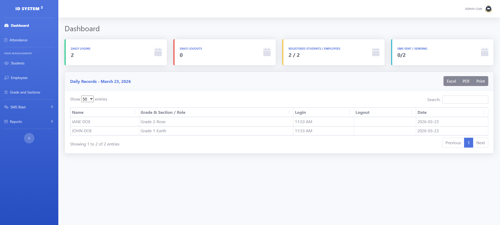
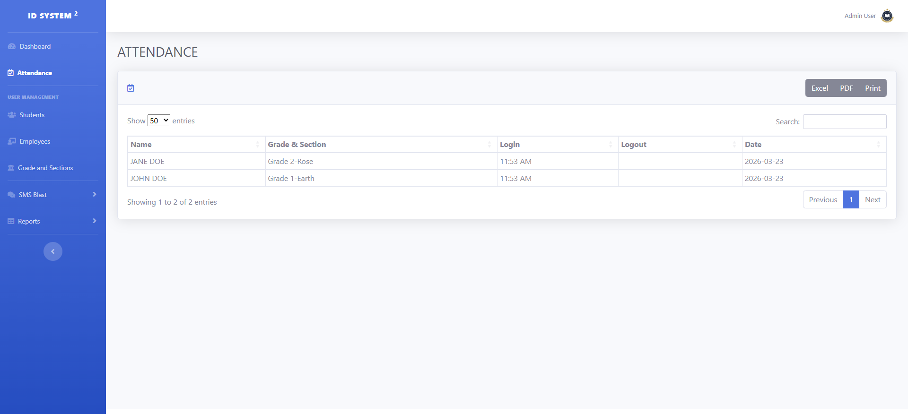
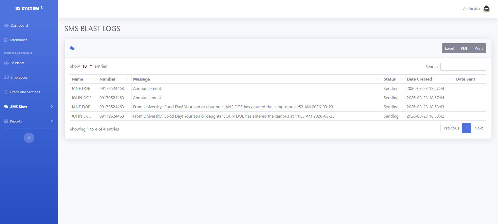

# RFID Attendance System with SMS Notification

A web-based attendance system that uses RFID technology to track student entry and automatically notify parents via SMS.

---

## Features
- RFID-based tap-in/tap-out attendance logging  
- Real-time attendance recording  
- SMS notifications to parents using GSM modem  
- Student and attendance management system  
- Web-based dashboard for monitoring  

---

## Tech Stack
- **Backend:** PHP (CodeIgniter 3)  
- **Database:** MySQL / MariaDB  
- **SMS Server:** C# (USB GSM Modem)  
- **Hardware:** RFID Reader  

---

## Highlights
- Deployed and used by 5 schools  
- Improved attendance monitoring and parent communication  
- Reduced manual tracking and reporting  

---

## Note
This project is a sanitized version for portfolio purposes.  
All sensitive data, credentials, and organization-specific details have been removed or replaced.

---

## 📸 Screenshots

